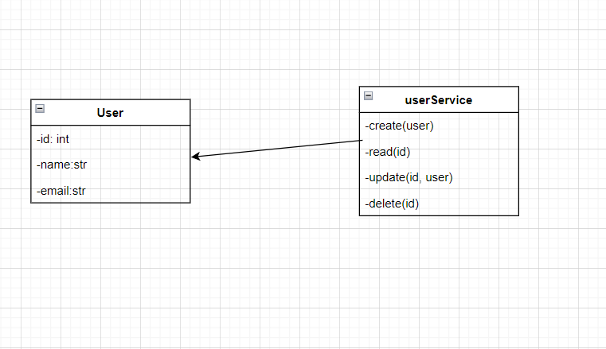

# Building a Simple CRUD API with FastAPI and SQLite

This API performs all four CRUD functions and uses a SQLite database to store and access data. The Person model has fields for name, email, id, and creation time. Here’s a diagram of the database model:



# Usage
1. Install the requiremnts
```
pip install -r requirements.txt
```

2. Run the server
```
uvicorn main:app --reload
```

3. Get all users(if you dont have requests please use the command below to download the package before testing)
```
pip install requests
```
```
	import requests

	response = requests.get('https://stage-2-flax.vercel.app/api/user_id', headers=headers)
```
  